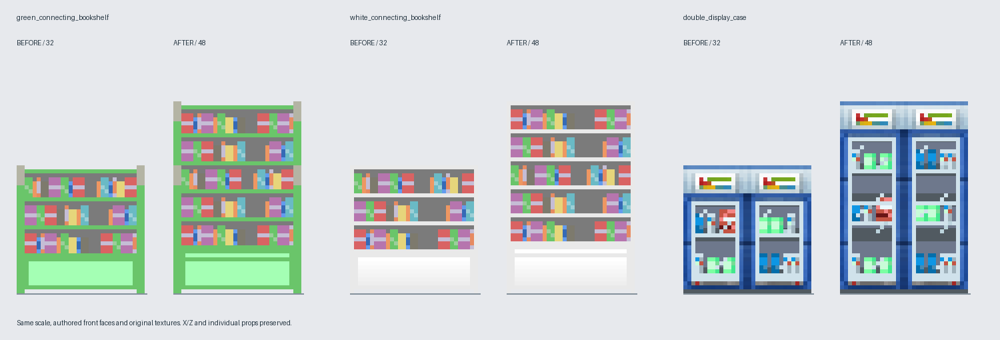

# 책장·진열장 높이 조정

세 편집 모델의 높이를 32에서 48로 변경했다. X/Z 좌표와 폭·깊이는 유지한다.

- 초록·흰 책장: 책 크기와 1단위 선반 두께를 유지하고 3단을 5단으로 구성했다.
  원래 책 배열을 교대로 재사용하며, 하부 수납부는 2단위만 높였다.
- 이중 진열장: 전시품 크기와 선반 두께, 상단 7단위 장식을 유지하고 2단을
  3단으로 구성했다. 각 진열칸 간격은 10에서 13으로 늘렸다.
- 길어진 기둥·뒷판·하부 앞판은 위/가운데/아래 UV로 나눈다. 위아래 테두리는
  각각 한 번만 원래 두께로 표시하고 가운데 면만 연속해서 확장한다.
  전체 무늬를 반복하지 않으므로 중간에 가짜 테두리가 생기지 않는다.
- 흰 책장의 예전 `core`, `left_end`, `right_end` JSON은 현재 사용되지 않는
  참고용이므로 원본 그대로 보존했다.

## 백업과 재생성

`../recovery/furniture-before-height-48-20260908/`에 수정 전 세 폴더와 참조 PNG를
보존했다. `sha256.json`으로 파일 무결성을 확인할 수 있다. 백업은 JAR에 포함되지 않는다.

`python object-workspace/raise-furniture.py`는 이 백업을 검증한 뒤 세 편집 JSON을
재작성한다. 이후 수동 편집을 했다면 재실행 시 해당 편집을 덮어쓰므로 주의한다.

## 게임 연결

설치·충돌·철거 범위는 가로 2칸, 높이 3칸이다. 기존 월드에 설치된 2칸 높이 가구는
새 상단 파트가 없으므로 철거 후 다시 설치해야 한다.

작업장 JSON은 바닥 기준 Y=0..48의 전체 모델이다. 빌드 시
`export-tall-furniture.py`가 Y를 -16만큼 이동한 게임용 복사본을 `build/generated`에
생성한다. 가운데 블록이 이를 렌더링하므로 Java 모델의 -16..32 좌표 범위를 지키면서
실제 월드에서는 바닥부터 높이 48로 표시된다. 편집 원본은 이동시키지 않는다.

검증: 백업 해시, X/Z 범위, 책·전시품 크기와 UV, 높이 48, 게임용 모델 좌표 범위와
원본의 월드 좌표 일치 확인. `compileJava processResources` 빌드 통과.
비교 이미지는 실제 모델 정면과 원본 텍스처이며 인게임 스크린샷은 아니다.
