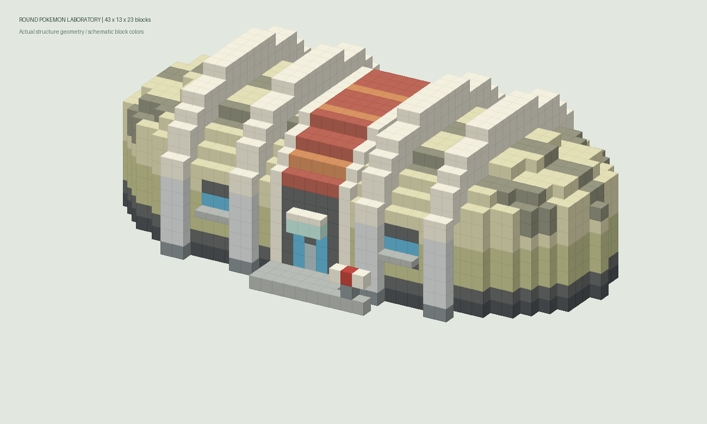
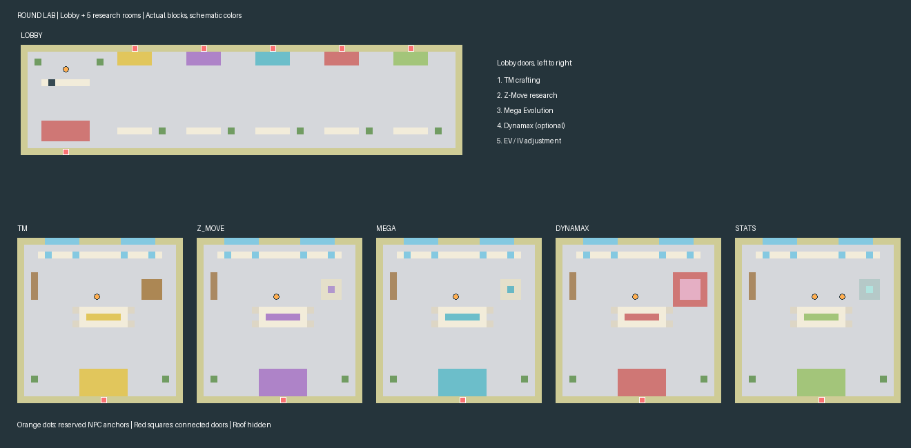

# 라운드형 포켓몬 연구소

참고 이미지의 둥근 양쪽 외벽, 크림색 배럴 지붕, 본체에서 돌출되어 지붕 위를 감싸는 흰 철골 프레임, 붉은 중앙 띠,
파란 창과 중앙 출입구를 블록으로 구성한 외관이다. 크기는 X/Y/Z 기준
43×13×23이며 정면은 북쪽(-Z)이다. 기존 오박사·화석 연구소와 같은
외관/독립 내부 공간 방식을 사용한다.



미리보기는 실제 생성 블록의 형상과 대표색을 표시하며 게임 텍스처 렌더는 아니다.

- 원본: `content-projects/cobbleventure-main/content/structures/placeholder/round_laboratory.snbt`
- 게임·웹 뷰어용 동일 데이터: 같은 경로의 `round_laboratory.nbt`
- 리소스 ID: `cobbleventure:placeholder/round_laboratory`
- 출입문: `[21, 1, 3]`, 외부 도착 위치: `[21, 1, 2]`
- 연결 내부: 전용 `cobbleventure:interiors/round_laboratory_lobby`와 연구실 5개

웹에디터를 새로고침하면 **NBT 건물 설정**에서 `round_laboratory`를 검색할 수 있다.
마을 배치 목록에는 **포켓몬 연구소(라운드형)**으로 등록된다. 기존 마을의 연구소를
자동으로 교체하지 않으므로 원하는 마을에서 새 외관을 선택해 배치한다.
오박사나 보상 NPC는 자동으로 복제하지 않는다.

## 내부 공간과 NPC 배치 준비



화석연구소의 연구실 바닥·크림색 벽과 오박사연구소의 작업대 배치를 참고했다.
긴 로비(64×8×16)에 안내 데스크·대기석·화분을 두고 북쪽에 연구실 문 5개를
나란히 배치했다. 각 연구실(24×8×24)에는 작업대, 서가, 창문, 연구 장비용
공간과 천장 조명을 배치했다. 도면은 실제 블록의 대표색을 쓰며 천장을 숨긴다.

외부 `door`는 `room_1:door`로 연결된다. 로비의 각 연구실 문은 같은 이름의
내부 공간 `door`로 연결되며, 런타임이 모든 연결의 귀환 경로를 자동 등록한다.
별도 역방향 route를 중복 등록하지 않는다.

| 공간 키 | 용도 | 후속 고정 NPC 배정 키 |
| --- | --- | --- |
| `room_1` | 로비·안내 | `room_1:receptionist` |
| `tm` | 기술머신 제작 | `tm:tm_researcher` |
| `z_move` | Z기술 연구 | `z_move:z_move_researcher` |
| `mega` | 메가진화 연구 | `mega:mega_researcher` |
| `dynamax` | 다이맥스 연구 예비실 | `dynamax:dynamax_researcher` |
| `stats` | 노력치·개체값 조절 | `stats:ev_researcher`, `stats:iv_researcher` |

현재 NPC는 배치 앵커만 준비하고 `fixed_npcs`는 비워 둔다. 제작·연구·능력치
서비스와 대화 스크립트는 아직 구현하지 않았다. 다이맥스는 선택 기능을 위한
예비실이며 현재 출입 제한은 없다. 향후 미사용 시 해당 내부와 로비 문 route를
함께 제거하거나 출입 조건을 설정한다.

기존 월드에 이미 생성된 내부는 자동 재건축되지 않을 수 있으므로 새 연구소
인스턴스로 확인한다. 인게임에서 외부↔로비 및 연구실 5곳 왕복, NPC 예정 위치,
모드 텍스처·조명을 최종 확인해야 한다.

재생성:

```powershell
python tools/structure-builder/generate_round_laboratory.py
python tools/structure-builder/preview_round_laboratory.py
python tools/structure-builder/generate_round_laboratory_interiors.py
python tools/structure-builder/preview_round_laboratory_interiors.py
python -m unittest discover -s tools/structure-builder/tests -p "test_round_laboratory*.py"
python tools/content-manager/content_manager.py validate --root .
```

생성기는 SNBT, NBT, 출입문 메타데이터를 함께 덮어쓴다. 형상을 코드로 변경할 때는
생성기를 수정하고 재생성한다. SNBT만 수동 편집하면 웹에디터용 NBT에는 반영되지 않는다.
웹 등록과 내부 연결은 `content/catalogs/building-settings.json`에서 관리한다.
내부 생성기는 전용 6개 공간의 SNBT·NBT·앵커 메타데이터를 재생성하고,
웹 등록·NPC 배정·문 연결 설정은 덮어쓰지 않는다.
